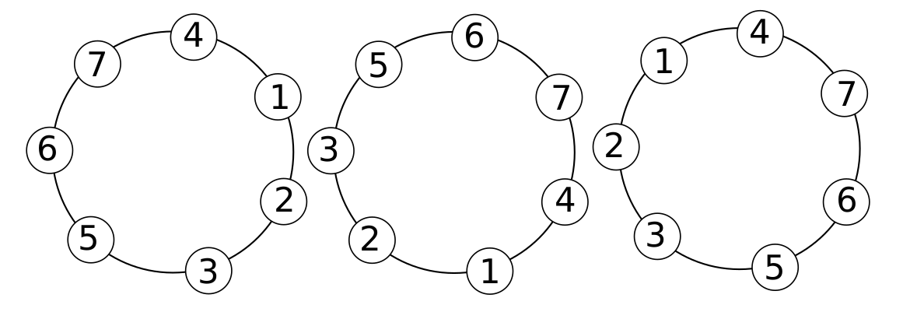
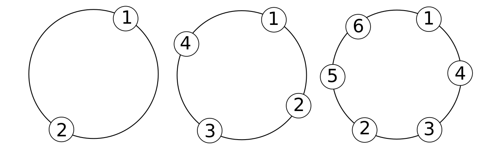
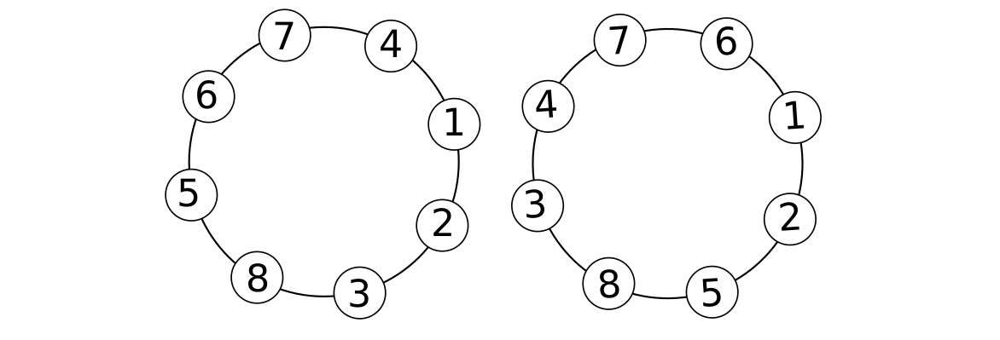

##  Introduction
A circle of order *n* is a circular permutation of numbers 1 through *n*. Two circles are equal if they differ only by rotation. As an example, the first two circles of the image below are equal, but the third is distinct from the first two.

 

A **prime circle of order** *n* is a circle of order *n* where all pairs of adyacent numbers add up to a prime number. For example, the following are prime circles of order 2, 4, 6 and 8.

We pretend to thoroughly count all prime circles of a given order.
